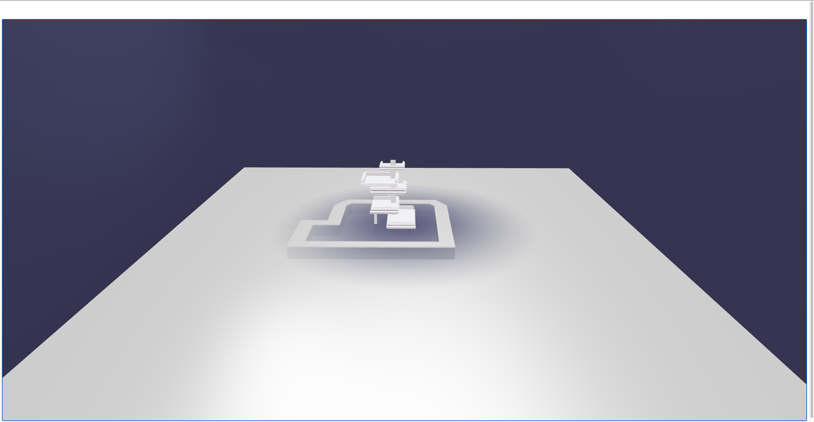
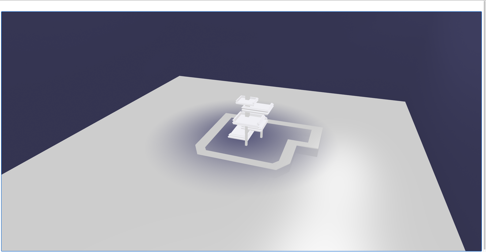

I was given to assignment to make an interactive web visualisation of the iconic fountain in front of the campus kaai and apply an online and offline interaction with the visualisation. To do this I worked with the WebGl technologie to bring 3D objects in to a static website. 

# CONCEPT 

## The first concept
I went with a few iterations for my concept. The first one was to make an interactive flow of water running from the fountain. This was pretty straight forward, as the first thing that came to mind when I saw the fountain was running water. However when I went to start gathering information on how to do this, I quickly came to the realisation that this was not an easy thing to do. The physics to simulate water running are incredibly complicated. I came across some good examples like this one

http://dev.miaumiau.cat/sph/ 

But as you can see it is very intense processing on the CPU and I did not want to have a laggy visualisation. The other option I had was baking it in the model in blender, but then the water would not be interactive anymore and just an animation on the model. So I cancelled the idea and went looking for a new idea.

## The game
As a big fan of games it looked like fun to develop a mini platform game that situated on the fountain. The idea was that the visitor was playing as a student and had the objective to climb the fountain. Simulating the climb that students have to do, to get their diploma. However for this idea most of my time would go to modelling assets to make the scene interesting and developing the game mechanics. This was far from the original idea to create an interactive web visualisation and wouldn’t have any connection to the other students, so my search for a fun concept continued.

## The point cloud
For my third concept I wanted to visualise the process that students go through to get their diploma. I wanted to do this by modelling assets that every multec student encountered over the years of their student career. These assets would be hidden when you first visited the scene but would rise from the bottom of each fountain platform one by one when the user would go to the preset path of the visualisation. I edited this idea a bit to have more of a symbolic visualisation than using just assets to visualise. In the scene you see particles rising from the bottom of the fountain, these represent students rising through the years to get to the graduation. Most particles won’t go to the top of the fountain as this is also the case with the students, only a small percentage of the students starting the course reach the end of it. I still wanted to use the idea to have the assets, but I liked the idea to use particles instead of solid assets. So instead of letting the assets rise from the platforms I used a point cloud. A point cloud replaces the faces of an asset with dot particles. This way I have control over each particle so I can animate them. The idea was to trigger these animations with easter eggs in the scene forming a point cloud representing the asset. But after making the first point cloud I noticed it had a big impact on the performance of the scene. So I decided to use only 1 point cloud and replace the other platforms with another type of visualisation.

## The final concept
For my final concept I went back to my first idea. After working with babylon.js for a few weeks I learned a lot of it's strengths and saw a different approach to simulate water running from the fountain. I decided to represent the drop of students for each year of multec with particles falling from the platform that looked like water. The amount of particles dropping from the platforms represent the amount of students dropping out of every year. As there are only 3 years in multec I had 2 platforms left to visualise. It seems fitting to represent the first platform as the entrance of the school, so I made a model of the front of the school and made a trigger to let the model rise from the bottom of the fountain. For the last platform I made a model of a graduation cap and applied the point cloud to it. I also made a trigger so the visitor has to activate the point cloud animation. I used the bottom particles rising from the bottom of the fountain to have an interaction with the amount of students that checked in to the school using another students installation. Each time a student checks in, the amount of particles rising from the fountain increases. This is done with the use of an api and websockets. When the visualisation first loads it does an api request asking for how many students are currently checked in. Then every time a user is checked in an event is sent with websockets telling that a student has checked in. This way the visualisation can keep an active record of how many students are checked in.

# FRAMEWORKS

## WebGL and Babylon.js
To render the 3D objects with WebGl I looked into a few frameworks. Two of them looked like a great fit, tree.js and babylon.js. While tree.js is the most known and there are a lot of great examples build upon tree.js, I still went with babylon.js. This because of the great documentation and features. In babylon.js every part of the docs is accompanied with an example in the playground. The playground is the second reason I went with babylon.js. In the playground I can play with all the features of Babylon in preset empty scene. This helped immensely in developing the scene because I also used a web framework to develop the scene, and having a space where i could develop features in plain javascript as described in the docs was a big help. In the following example you can see my playground for the point cloud system. Here I used 2 assets from the playground library to animate between the 2 point clouds. 

https://www.babylonjs-playground.com/#2S8L5U#85  

## Vue.js
To have a cleaner codebase and to have common parts easy to reuse I also used a web framework to develop the scene. For the web framework I chose Vue.js. This was mainly because there was a nice package that combined Vue and babylon.js. The package gave me access to common objects of the babylon.js framework as Vue components like the camera, lights, the mesh builder,…. This gave me a good starting point to build upon. But as someone with no babylon.js experience it also made some parts a lot harder as every example was build in plain js. And accessing the objects in the different scopes was not always easy.

## Vuetify
For the GUI I used the Vuetify framework. This is a framework build upon Vue that gives me access to material design based components. This had all I needed to build a nice GUI, like buttons, checkboxes, sliders,… and was made using the features given by Vue so it was good fit into my application.

## VueX
To completely use the power of Vue I implemented Vuex. This is an extension of Vue, that gives you the ability to easily store variables in the session storage. Without Vuex I would have to pass every user input to all the components. With Vuex I stored the values in the session storage and could access it from every component with ease, giving me a much cleaner code base.

# GUI INTERACTION 

It was important that the scene was an interactive experience for the user. Being able to look around in the scene was a nice start but to make it a full experience I wanted to make the look and feel completely customisable by the user. To do this I made use of a GUI to give access to the parameters used to build the scene. With this the user could alter these parameters to change the look and feel of the scene.
Parameters the user could change are: 

- The light
- The amount of fog in the scene
- The color of the particles and water
- The amount of particles 
- The speed of the particles 
- The height particles can reach 
- The camera positions

# DESIGN

For the design of the scene I wanted to focus on effects the light and particles would bring, therefore I kept the scene dark. I wanted to give it a mysterious vibe so I used fog to cover the scene and gave the fountain a mystical glow effect.

# PROCESS

  

# How expensive would it be to build this application?

As this is a web application it does not have any physical parts that have to be bought to build it. However the time to build it does add up.
The part where I put the most time in was learning Babylon.js, Babylon is by far the largest framework I ever worked with and after working with it for a lot of hours, I realise I only scratched the surface of its capabilities. But when you ask an experienced Babylon developer to build the app this amount would be much lower so I will only count a part of it in my calculation.

Time spent:

- Learning babylon: 30 hours (I will count 10 hours)
- Concept phase: 10 hours
- Gathering resources and examples: 5 hours
- Learning Blender: 4 hours
- Building the fountain in blender: 2 hours
- Exporting the fountain to the correct format and installing plugins: 1 hour
- Learning Vue, Vue and Vuetify: 8 hours
- Project setup: 6 hours
- Project phase 1 (importing the fountain, setting up the scene, setting up the camera , basic lighting): 4 hours
- Setting up the Vuex store: 3 hours
- Project phase 2 (animating cameras over the platforms, first part of GUI ): 12 hours
- Project phase 3 (animating the light, first scene design): 4 hours
- Project phase 4 (implementing first particles, water glow shader, adding fog): 16 hours
- Scene intro: 6 hours
- Point cloud animation: 8 hours
- Meetings with project manager (the teachers): 10 hours 
- implementing the point cloud: 6 hours
- modelling asset for the point cloud: 1 hour
- moddeling the school front: 2 hours
- additional GUI controls: 4 hours
- implementing websockets: 1 hour
- easing the cameras & camera angels: 5 hours
- adding water running from the fountain: 8 hours
- adding the timeline: 2 hours
- autorun the timeline: 2 hours
- improving intro: 3 hours
- simulation of student data: 1 hour
- click controls for pointcloud and school: 3 hours
- only run water when camera hits the platform: 4 hours
- adding noise filter over the visualisation: 3 hours

In total The consultant would be working for 18 days on this project. If the consultant would ask 450 euro per day for 8 hours / day the total cost up until now for the application would be 450 * 18 = 8100 euro.
